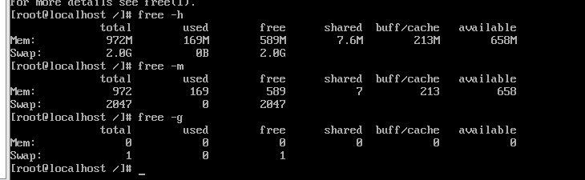

## free

```
free -m  # 以MB为单位进行显示
free -h # 自动识别单位
```

 


buff/cache：linux使用内存的原则，如果有空闲内存，会尽量去占用。这个也就是buff/cache存在的意义。所以目前使用的内存，应该是available+buff

swap：交换分区，其实也就是虚拟内存。将一部分磁盘当作内存来用。如果swap开始被占用了，那么内存空间就真正不够用了。
备注：如果内存不够用的话，会随机杀死进程，进行回收内存。

## top 动态查看内存

