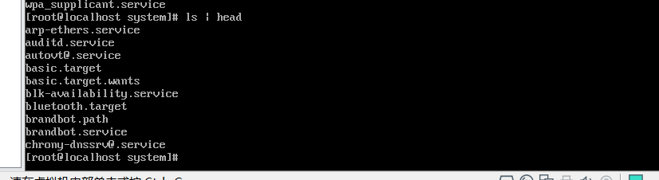
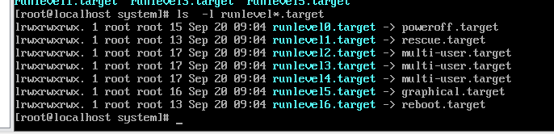
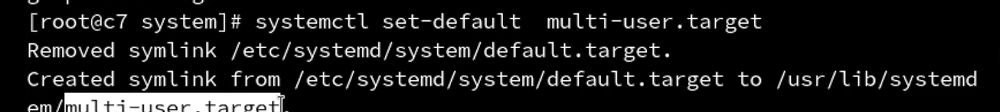
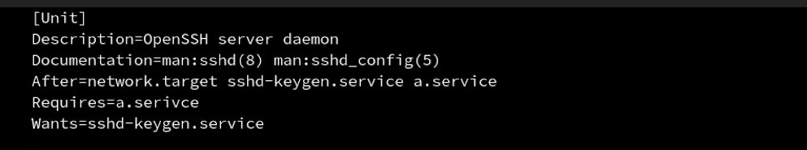

服务（提供常见功能的守护经常）集中管理工具

+ service
+ systemctl


systemctl是service的进阶版本

service脚本工具，集中管理在`/etc/init.d`里面


systemctl脚本工具集中放置在`/usr/lib/systemd/system`中



systemctl对服务进行模块化管理，看上图中的服务名称后面，都加上了一个service，因此`systemctl stop sshd.service`


开机启动

```
systemctl enable sshd.service
```

systemctl的级别是在同目录下的target文件中。



图形界面和字符界面都是其中的一个级别罢了。

修改级别，比如修改成字符界面级别。



服务启动的顺序，因为有些服务的启动，需要依赖其他服务，所以我们可以在service文件中，unit中增加选项。



