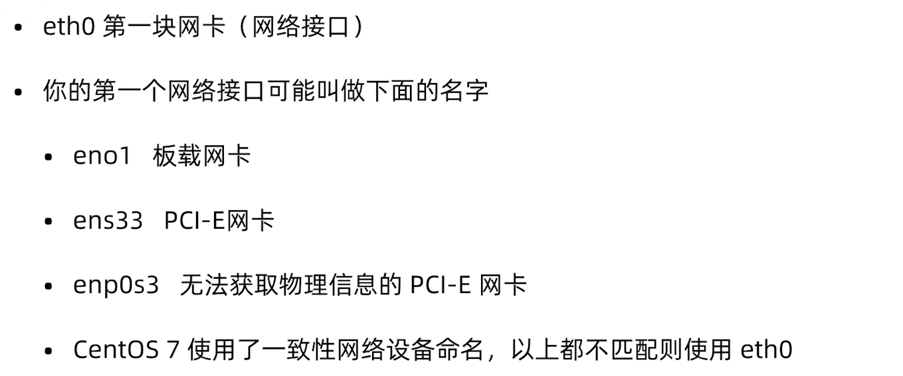
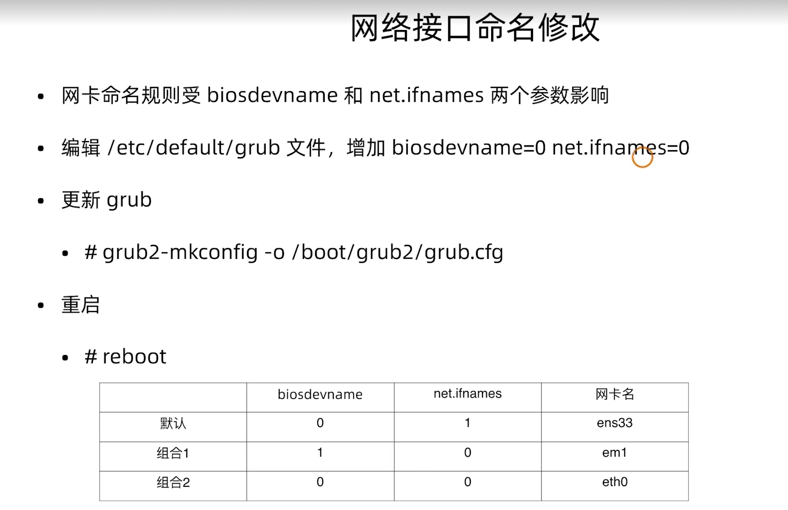
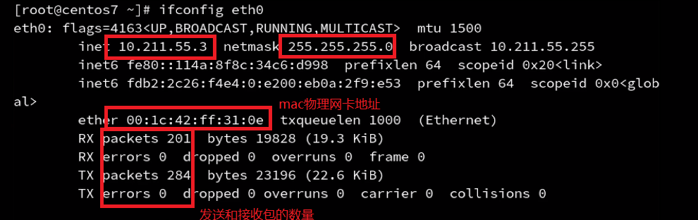
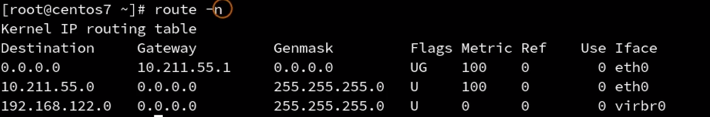
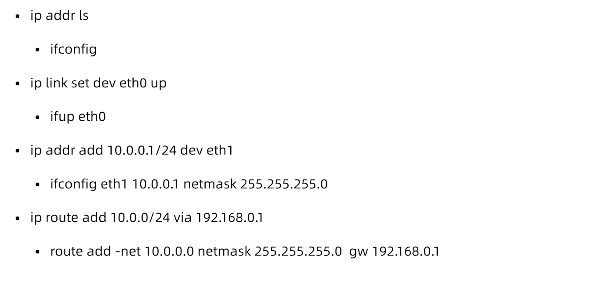
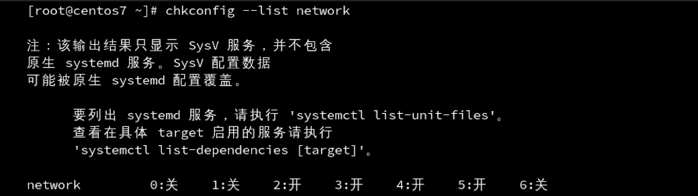
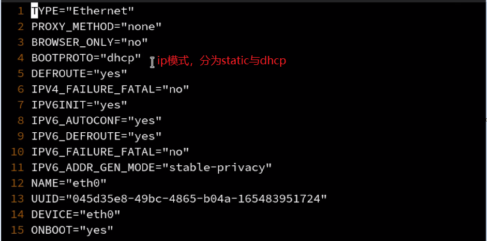
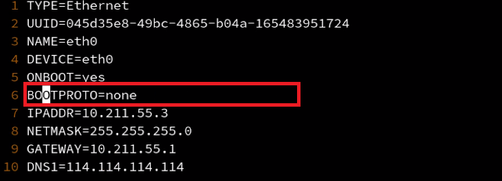

[toc]


## 网络状态查看

centos7包括之前，使用的是ifconfig，centos7之后（centos8）使用的是ip。	

ifconfig输出解析



将网卡结果改回城eth0，因为网卡名称太多，不容易统一进行管理。 



ifconfig结果解析




## 物理网线状态查看

```
miit-tool eth0
```

查看eth0的网线链接状态


### 路由查看




## 通过命令行修改网络配置

### ifconfig修改ip

ip地址一次性命令

```
ifconfig eth0 192.168.0.1 255.255.255.0
ifup eth0
ifdown eth0 
```

### 添加网关

```
添加网关
route add default gw <网关ip>
route add -net <指定网段> betnask <子网掩码> gw <网关ip>
route add -host <指定网段> netmask  <子网掩码> gw <网关ip>
删除网关
```


### ip和网关一把梭



## 通过配置文件修改网络配置

网络服务管理程序分为两种，service与systemctl。

```
service network start|stop|restart|status
systemctl start|stop|restart NetworkManager
systemctl enable|disable NetworkManager
```

所以我们要禁用掉一种方案。

NetworkManager可以自动识别网络的状态，自动进行识别。但是在服务器上，仍然使用的是service network这个选项。

禁用NetworkManager

```
systemctl disable NetworkManager
```

禁用network

```
chkconfig --level 2345 network off
```



### 网络配置文件

配置文件有两个`ifcfg-eth0`与`/etc/hosts`

`/etc/sysconfig/network-scripts/ifcfg-eth0`内容查看

dhcp模式



静态地址模式



主机名


