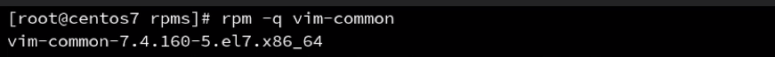
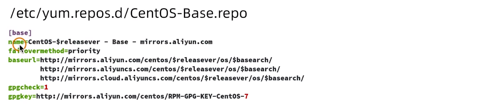
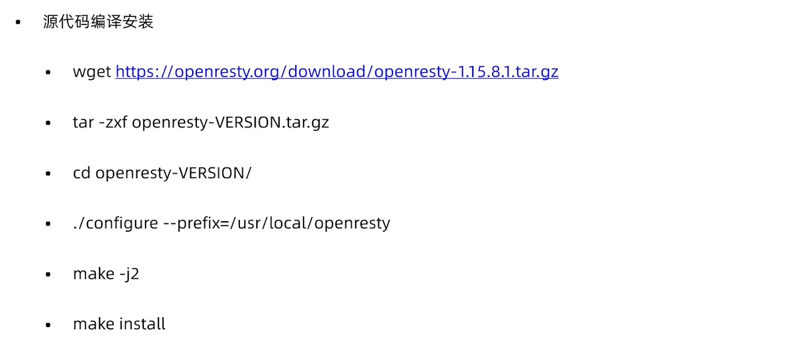
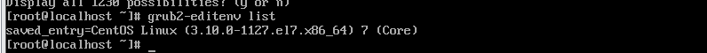
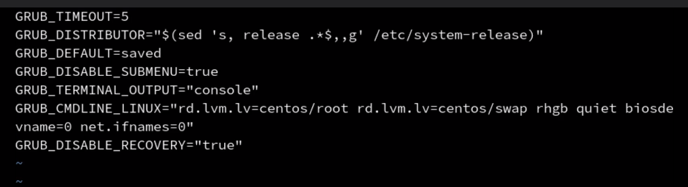
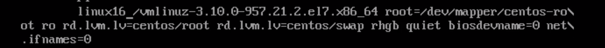
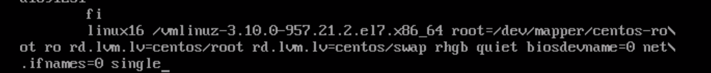

## 软件包管理器

### 使用rpm命令安装软件包

rpm包格式


rpm 

-q 查询软件包



-i 安装软件包


-e 卸载软件包


依赖关系需要通过先安装前面一个软件，才能安装这个软件。有个简便的方式，就是将多个软件包同时放在一个文件夹内，从而使得不需要考虑依赖而安装软件。如果把这个文件夹放在网上，那么这个文件夹就叫做软件仓库。centos提供了一个软件仓库`yum`


### yum 安装包

换源

自己编写yum配置文件



自己下载yum配置文件


yum makecache的目的：

生成缓存，将目前安装的软件指向新地址


### 二进制安装




### 升级内核

查看内核

```
uname -r
```


yum安装

可以使用epel对软件仓库进行扩展

```
扩展yum软件源
yum install epel-release -y 
找到yum仓库中最新的kernel版本的内核
yum install kernel
```

### 源代码安装

```
安装依赖 
yum install gcc gcc-c++ make ncurses-devel openssl-devel elfutils-libelf-devel
下载并解压内核
tar -xvf linux-5.1 -C /usr/src/kernels
配置内核编译参数
cd /usr/src/kernels/linux-5.1
make menuconfig|allyesconfig|all no config
或者使用当前系统内核配置
cp /boot/config-kernelversion.platform /usr/src/kernels/linux-5.1.10/.config
编译 
make -j2 all
(查看cpu个数 lscpu)
安装内核
make modules_install
make install 
```


## grub2的配置文件

配置启动项

配置启动文件

```
修改配置项
简单配置
/etc/default/grub
详细配置/etc/grub.d/
修改配置项，然后输出
grub2-mkconfig -o /boot/grub2/grub.cfg
```

查看系统内的内核



### 查看启动项

```
/etc/default/grub 查看
```



去掉quite可以打印更详细的信息。

修改启动内核项

```
grub ^menu/boot/grub2/grub2.cfg
grub2-set-default  0
```


找回root密码

1. 进入bios界面，按e
2. 选择



3. 添加single

   

4. 如果是centos7 的话，那么就选择 `rd.break`
5. 启动以后，修改根目录


6. 修改root密码


