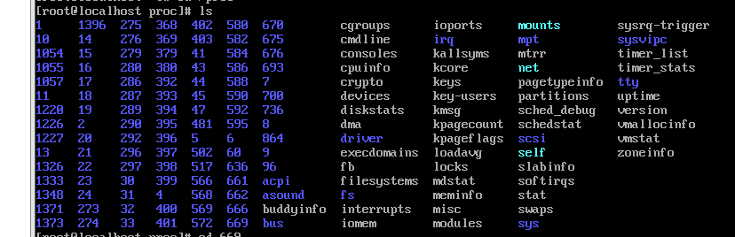
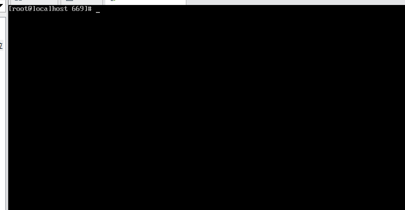
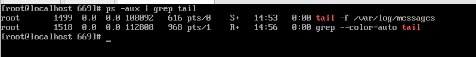
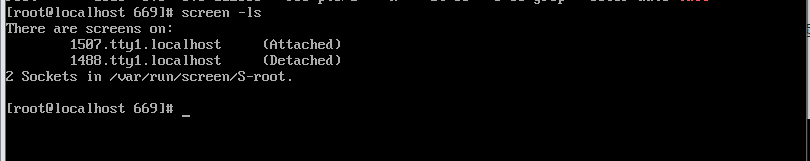

## 进程优先级调整

未运行程序

```
nice -n 10 program
```

程序运行中，修改优先级

```
renice -n 15 id
```

后台执行程序

```
./a.sh &
```

程序前后台切换

```
jobs 查看后台运行的程序
fg id 将后台运行的程序调用到前台
ctrl+z 将程序先停止
bg id 将暂停的程序调用到后台执行
```


## 进程通信

```
kill -9 id
```


## 守护进程

随着linux的开机而自动启动

### nohup

```
nohup 命令 & 
```

保护进程，不被终端所限制。
孤儿进程必须被其他进程所保护，其父进程被kill以后，就需要1号进程进行收留。


/proc/目录 操作系统读取内存的信息。内部有很多与进程号同名的目录。




### screen 

使用screen进入终端后的终端



使用ctrl+a+d 推出screen终端，但是screen中运行的程序并不会停止。



使用screen -ls 查看当前有几个screen终端还在运行。



重新进入screen 

`screen -r 1507`


