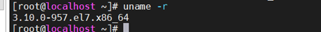
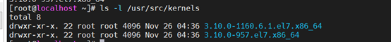
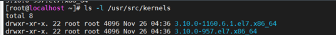

# 查看版本

查看内核版本



查看内核头部的版本




# 安装对应的内核头部

从存储库中安装正确的`kernel-devel / linux-header`
## 通过软件仓库
+ 更新软件源
+ 安装内核头部


### 更新软件源

```
[root@localhost ~]# yum install -y wget
wget -O /etc/yum.repos.d/CentOS-Base.repo http://mirrors.aliyun.com/repo/Centos-7.repo
#或者，如果没有wget命令，则使用下面
curl -o /etc/yum.repos.d/CentOS-Base.repo http://mirrors.aliyun.com/repo/Centos-7.repo
```


### 安装内核头部

```
 yum install kernel-devel-`uname -r`
```

## 通过rpm包安装内核头部
如果在yum软件仓库中没有找到对应的内核，则需要手动安装rpm
```
https://linuxsoft.cern.ch/cern/centos/7/updates/x86_64/repoview/kernel-devel.html
```
可以在这个网站中查找对应的内核头部
找到后，上传到centos服务器，使用rpm安装

```
rpm -ivh kernel-devel-3.10.0-957.el7.x86_64.rpm
```

# 注意

如果提示，有更新的内核头部安装的更高版本呗安装，则需要先进行卸载更高版本的

## 查看最高版本的



## 卸载内核头部

这里的`3.10-1160.6.1.el7.x86_64`头部是最新的卸载即可

```
rpm -ivh kernel-devel-3.10-1160.6.1.el7.x86_64.rpm
```

## 安装需要安装的内核

```
rpm -ivh kernel-devel-3.10.0-957.el7.x86_64.rpm
```

### 特别注重的一点

**卸载内核头部操作很严重，不能随便操作**