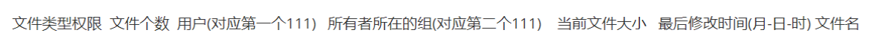
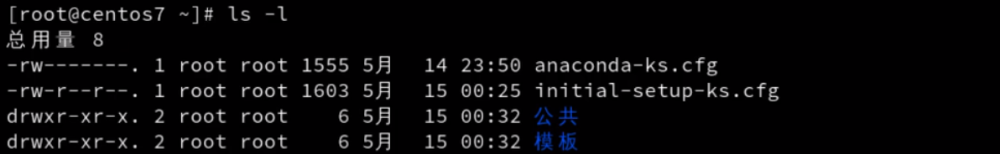
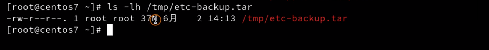
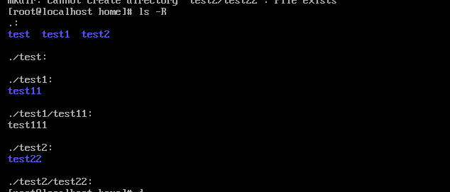

# ls命令


ls 一次性查看多个目录，要在文件夹中间加入两个空格

```linux
ls /  /root
```

## ls -l

显示文件的长格式






## ls -h

大小以M 或者G的形式显示




## ls -a 

查看所有文件（包括隐藏文件）

## ls -r

辅助`ls -l`，结合成`ls -l -r` 逆向输出

按照时间逆向输出`ls -l -r -t`,可以合并成`ls -lrt`

## ls -R

递归显示




# cd 命令

cd 进入绝对路径 `cd  /` 

cd 进入当前相对路径`cd ./`  

cd 进入 上一层相对路径`cd ../..
