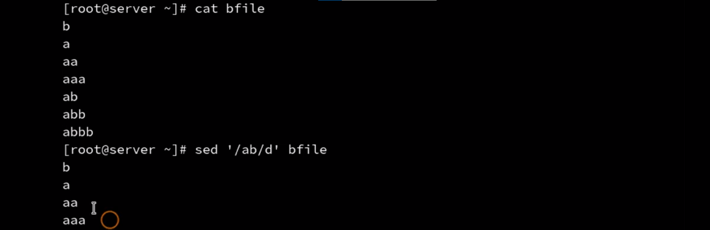
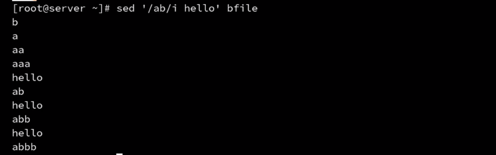
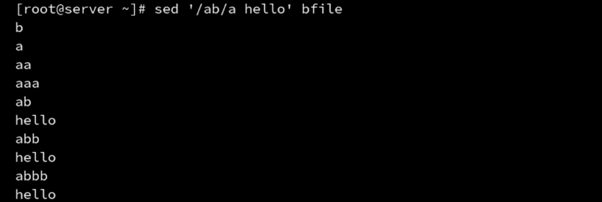
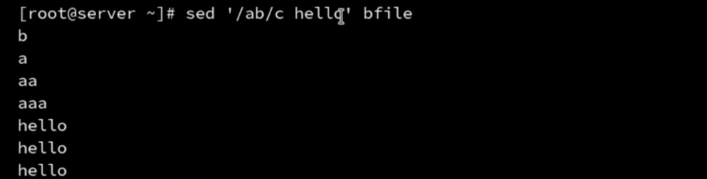

## 删除模式

### `d`指令

将匹配到的模式空间进行删除，即将一整行数据删除掉

改变脚本的控制流，	即d后的所有字符都不会被执行。

##  追加插入指令

插入指令`i`，即向前插入

追加指令`a`,即向后追加

修改指令，`c`

	## 读写文件

读文件命令`r`

写文件命令`w`

## 下一行

只想读取文件的奇数/偶数行

下一行命令`n`，比如偶数行匹配，奇数行跳过

