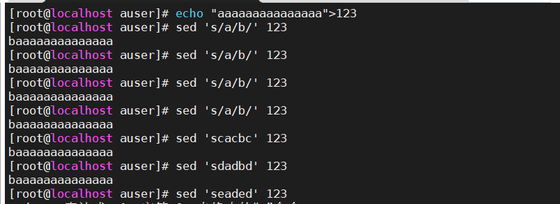
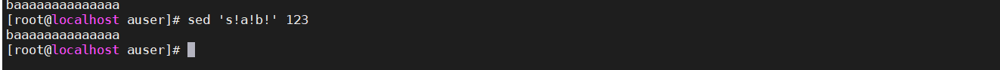
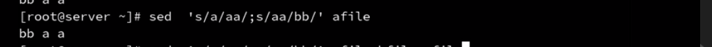
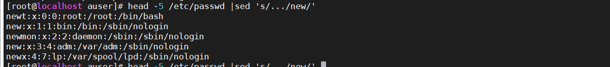
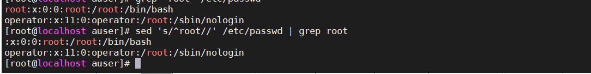

sed和awk是行编辑器

## vim与sed的区别

区别：

+ 交互式与非交互式

+ 文件操作模式与行操作模式

  sed是行编辑器，是一行一行进行操作

## sed的作用

sed一般用于对文本内容进行替换

例如：

```
sed '/user1/s/user1/u1' filename1 filename2	
```

逐行对filename1与filename2进行进行`/user1/s/user1/u1`操作。


## 替换命令讲解

基本工作方式：

+ 将文件以行为单位读取到内存
+ 使用sed的每个脚本对该行进行操作
+ 处理完成后输出该行

sed的替换命令为:`s`

```
sed 's/old/new' filename
sed -e '/s/old/new' -e 's/old/new' filename # 替换多个处理语句
sed -i 's/old/new' 's/old/new' filename # 替换完成的结果原样写回到文件中
sed -r 's/扩展正则表达式/new' filename
```

old可以使用正则表达式


## 斜线的处理

如果需要将`/`替换成其他字符，如test。那么应该需要将替换语句中的`/`替换成其他字符，如下



但是，由于为了方便用户辨认，一般默认都是使用`!`来进行替代

```
sed 's!a!b!' 123
```




## 多个处理语句

多个处理语句可以使用 -e进行分割，但是，为了简便，也可以使用分号




## 写入原始文件

```bash
sed -i 's/old/new' 's/old/new' filename # 替换完成的结果原样写回到文件中
```

利用重定向，写入其他文件

```bash
sed -i 's/old/new' 's/old/new' filename >newfilename 
```


## 正则匹配



可以看出每一行只会匹配一次

找到以root开头的行，进行操作



## 扩展正则匹配

```
+          代表其前面字符出现一次或多于一次
?          代表其前面字符出现0次或1次
|          代表或
( )        代表一个组字串
( )+       代表组字串出现任意多次
```

其中`|`一般是和`()`一起使用

```bash
 sed -r 's/(sbin)|(bin)/new/'  /etc/passwd 
```

