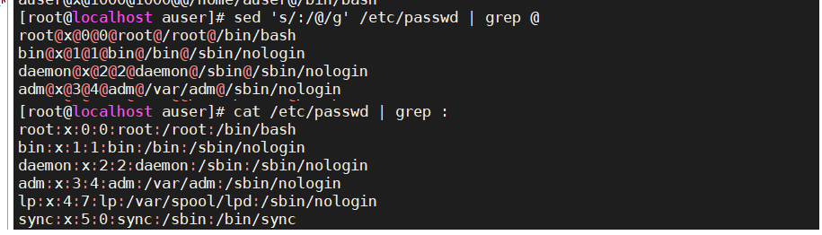
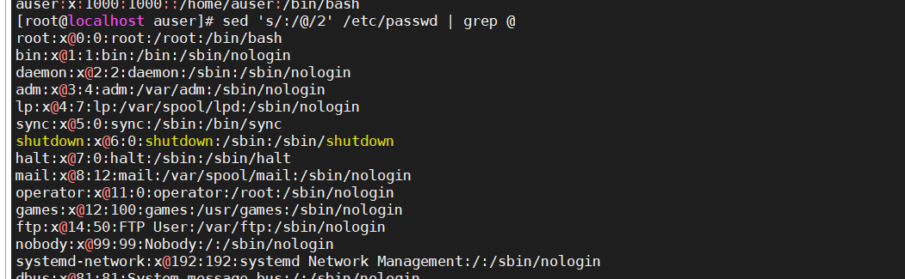

## sed全局匹配

将匹配到的内容进行全局匹配

```
sed 's/old/new/g' filename
```

解释

+ 期中g为全局匹配，用于匹配所有出现的次数
+ '/'如果与匹配的内容相冲突，可以使用其他符号（字母也可以，但为了方便辨认，所以用符号会更好）




匹配每行第二次出现的内容

```
sed 's/old/new/2' filename
```




## 寻址

默认对每行进行操作，增加寻址后对匹配的行进行操作

### 正则表达式

通过正则表达式进行，行过滤

```
/正则表达式/s/old/new/g
```


### 通过行号

行号可以是数字，也可以选择`$`

```
sed 'a,bs/new/old/' filename 从a到b行进行操作
sed 'as/new/old' filename 在第a行进行操作
```

从第一行到最后一行


### 混合

选择第二行到结尾的内容，并且以bin开头的进行替换

```
sed '/^bin/,$s/nologin/!/' /etc/passwd
```


### 寻址加匹配多条语句

```
/正则/{s/old/new;s//old/new}
```


## sed脚本

可以将sed作为脚本保存起来，这样子，下一次就不需要进行书写了，直接调用即可

通过-f调用

```
sed -f sed_script  filename
```

