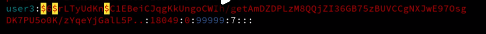

visudo命令，将特殊命令赋值给一般用户

用户直接就写username即可，如果是用户组，则需要在前面添加百分号。%users。

`all`代表登陆终端，如果是本地的话就可以写成localhost。

## 用户配置文件

### `/etc/passwd`

中文含义

- 用户名:密码:UID（用户ID）:GID（组ID）:描述性信息:主目录:默认Shell
- 其中的x，代表该用户需要密码登陆。
- 第一个1001代表用户的uid
- 第二个1001代表用户的groupid

`/etc/shadow`

九个字段含义解释:

#### 用户名

同 /etc/passwd 文件的用户名有相同的含义。
#### 加密密码

这里保存的是真正加密的密码。目前 Linux 的密码采用的是 SHA512 散列加密算法，原来采用的是 MD5 或 DES 加密算法。SHA512 散列加密算法的加密等级更高，也更加安全。

注意，这串密码产生的乱码不能手工修改，如果手工修改，系统将无法识别密码，导致密码失效。很多软件透过这个功能，在密码串前加上 "!"、"*" 或 "x" 使密码暂时失效。

所有伪用户的密码都是 "!!" 或 "*"，代表没有密码是不能登录的。当然，新创建的用户如果不设定密码，那么它的密码项也是 "!!"，代表这个用户没有密码，不能登录。

#### 最后一次修改时间

此字段表示最后一次修改密码的时间，可是，为什么 root 用户显示的是 15775 呢？

这是因为，Linux 计算日期的时间是以 1970 年 1 月 1 日作为 1 不断累加得到的时间，到 1971 年 1 月 1 日，则为 366 天。这里显示 15775 天，也就是说，此 root 账号在 1970 年 1 月 1 日之后的第 15775 天修改的 root 用户密码。

那么，到底 15775 代表的是哪一天呢？可以使用如下命令进行换算：

[root@localhost ~]# date -d "1970-01-01 15775 days"
2013年03月11日 星期一 00:00:00 CST

可以看到，通过以上命令，即可将其换算为我们习惯的系统日期。

#### 最小修改时间间隔

最小修改间隔时间，也就是说，该字段规定了从第 3 字段（最后一次修改密码的日期）起，多长时间之内不能修改密码。如果是 0，则密码可以随时修改；如果是 10，则代表密码修改后 10 天之内不能再次修改密码。

此字段是为了针对某些人频繁更改账户密码而设计的。

#### 密码有效期

经常变更密码是个好习惯，为了强制要求用户变更密码，这个字段可以指定距离第 3 字段（最后一次更改密码）多长时间内需要再次变更密码，否则该账户密码进行过期阶段。
该字段的默认值为 99999，也就是 273 年，可认为是永久生效。如果改为 90，则表示密码被修改 90 天之后必须再次修改，否则该用户即将过期。管理服务器时，通过这个字段强制用户定期修改密码。

####  密码需要变更前的警告天数

与第 5 字段相比较，当账户密码有效期快到时，系统会发出警告信息给此账户，提醒用户 "再过 n 天你的密码就要过期了，请尽快重新设置你的密码！"。

该字段的默认值是 7，也就是说，距离密码有效期的第 7 天开始，每次登录系统都会向该账户发出 "修改密码" 的警告信息。

#### 密码过期后的宽限天数

也称为“口令失效日”，简单理解就是，在密码过期后，用户如果还是没有修改密码，则在此字段规定的宽限天数内，用户还是可以登录系统的；如果过了宽限天数，系统将不再让此账户登陆，也不会提示账户过期，是完全禁用。

比如说，此字段规定的宽限天数是 10，则代表密码过期 10 天后失效；如果是 0，则代表密码过期后立即失效；如果是 -1，则代表密码永远不会失效。

#### 账号失效时间
同第 3 个字段一样，使用自 1970 年 1 月 1 日以来的总天数作为账户的失效时间。该字段表示，账号在此字段规定的时间之外，不论你的密码是否过期，都将无法使用！
该字段通常被使用在具有收费服务的系统中。

## `/etc/group`组的相关信息

最后一个字段，是其他组。代表这个组中的某些用户还属于其他组。

