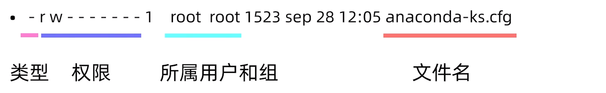
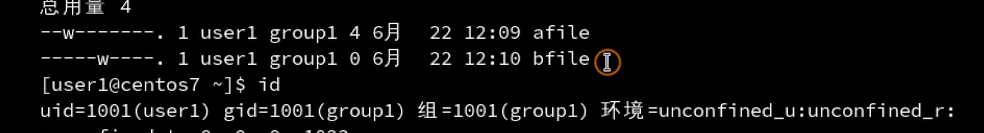
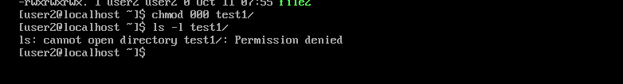
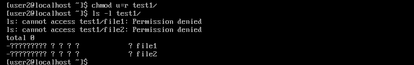

## 文件权限

不同文件类型，linux不是以扩展名进行区分，而是以文件类型进行区分，

| 符号 | 含义 |
| ---- | :--- |
|`-`|普通文件|
|`d`|目录文件|
|`b`|块特殊文件,指的是设备，比如插上u盘，那么u盘就是一个块设备|
|`c`|字符特殊文件|
|`l`|符号链接|
|`f`|命名管道|
|`s`|套间字文件|

​                                                                                                                                                                                                                                                                                                                                                                                                                                                                                                                                     

字符与数字的关系

rwx =111,

r=100，是4

w=010,是2

xx=001,是1

## 文件夹权限的表示方式

| 字符 | 含义               |
| ---- | ------------------ |
| x    | 进入目录           |
| rx   | 显示目录下的文件名 |
| wx   | 修改目录下的文件名 |

## 修改文件用户权限

chmod 修改文件、目录权限

+ `chmod u+x /dir`
+ `chmod 755 /dir`

chown 更改属主、属组。

修改属主 `chown newuser dir`

修改属组 `chown :newgroup dir`

## 修改文件权限

`chmod 通过加减进行权限控制。`

`chmod u` 代表属主；`chmod g` 代表属组；`chmod o` 代表其他；`chmod a` 代表所有；

| 字符 | 含义 |
| ---- | ---- |
|    `chmod u+x  | 给属主文件加上执行的权限     |
|    `chmod u=x  | 属主文件只有执行的权限    |
|    `chmod u-x  | 属主文件去掉执行的权限    |

更简便的方式——通过数字

`chmod 446 file` 将446权限赋值给file用户。

## 权限管理

当权限发送冲突时候，以属主为准，如下图：

user1 对bfile没有任何权限，但是group1有可删除权限，那么就是属主原则，没有任何权限

### 文件夹目录

x表示进入目录

r表示读取文件夹内的子文件

下面两张图是相反的两张图

w表示在文件夹内创建和删除子文件的权限

x表示在文件夹内

### 特殊的权限

