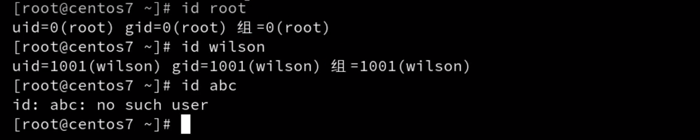

## 用户新建

`useradd`

`id username` 查看 `username`是否在用户表中

用户相关配置文件

 `/etc/passwd`，用户文件

`/etc/shadow`，用户密码文件

如果创建的时候没有指定组，就会单独创建一个同名的组

`passwd username`，为username指定密码。

## 用户删除

`userdel username`删除用户

做的操作

+  `/etc/passwd`中删除相关用户
+ `/etc/shadow`中删除相关密码
+ home目录的id变为1000

`userdel -r username`删除用户的同时删除该用户的家目录

## 修改用户属性

`usermod -d /dir username`修改该用户的默认家目录

`usermod -g group username`修改该用户的默认组

`change`修改用户的生命周期

## 切换用户

​	`su username` 不完全切换

`su - username` 完全切换，切换的同时，切换到家目录

