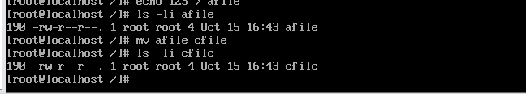
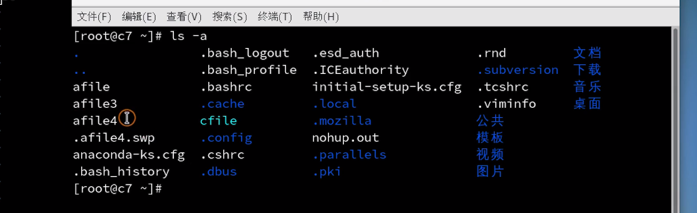
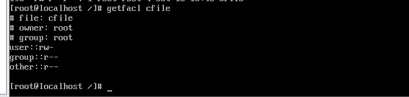

## 文件系统

本篇文章介绍linux使用最广泛的文件系统——ext4

ext4包括四部分

+ 超级块，在ext4文件系统开始的部分，记录分区包含了多少个文件，
+ 超级块副本，对超级块进行备份，恢复数据，就可以通过恢复超级块进行恢复数据。因为数据块的内容并没有被覆盖掉。
+ i节点，记录每个文件，文件的名称和大小，文件的编号和权限。但是文件名和编号并没有放在同一个i节点里面。文件点是放在文件的父亲i节点里面。
+ 数据块，记录数据。同个文件可以划分成多个数据块，挂载到同一个i节点中。

通过i节点，这个概念。也可以明白了为什么mv的时候会这么快，mv改名只是改动了i节点中的文件名。



所以，如果i节点发生了变化，那么该文件就不是原文件了。

vim操作的话，是vim打开一个文件的时候会创建一个swp版本的文件。我们其实是对这个进行操作，操作完以后，会将swp文件命名为原来的文件名，这样子也就是为什么vim操作以后i节点会发生改变。



所以删除文件，其实是将i节点与文件名断开，只要找到i节点，那么就能恢复文件。防止误删的一个操作就是通过ln命令进行硬连接，从而使得两个文件名指向同一个i节点。这样子的话，这两个文件名是等同的。	所以ln是不能跨越分区的。

```
ln filea fileb # 为fileb创建硬链接filea
ln -s filea fileb # 为fileb创建软链接filea，其实就是创建一个快捷方式
```

### ext4文件访问控制列表

ext4独有，可以单独设置一个用户的读写权限。

查看某个文件的访问控制列表

```
getfacl afile
```



赋予权限

```
setfacl -m u:user1:r afile # 为user1用户组赋予读的权限
setfacl -m g:group1:rw afile # 为group1用户组赋予读和写的权限

```


## RAID 磁盘阵列

| raid级别 | 含义                                                         |
| -------- | ------------------------------------------------------------ |
| raid 0   | 一个数据拆成两份，一份数据拆成两份，存到两个地方，提高200%的读取速度 |
| raid 1   | 镜像方式 ，一份数据会自动备份到第二块磁盘，提高200%的可靠性，但是两块磁盘里面，只有一块磁盘可以用。 |
| raid 5   | 至少有三块硬盘，两块存数据，第三块存校验值。                 |
| raid 10  | 0和1的组合   四块硬盘  两块做raid1 两块做raid1 .两块做了raid1的磁盘拿出来做raid0 |

通过硬件设备完成，通过raid控制器来进行raid操作。

软件raid，cpu开销非常大。
