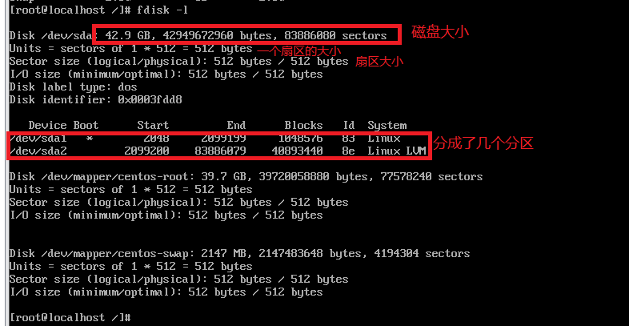
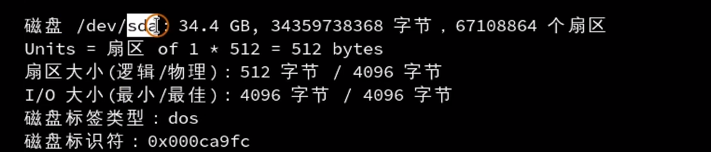
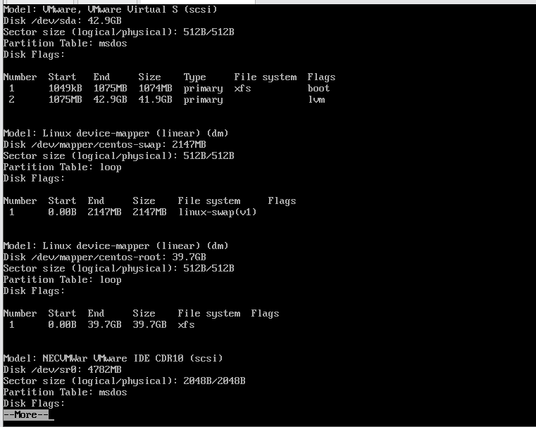
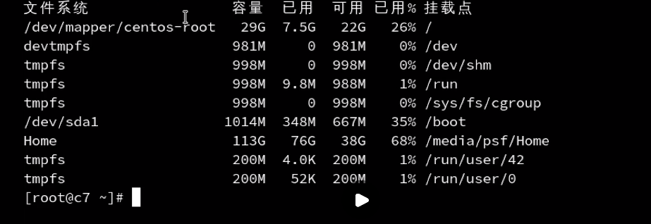
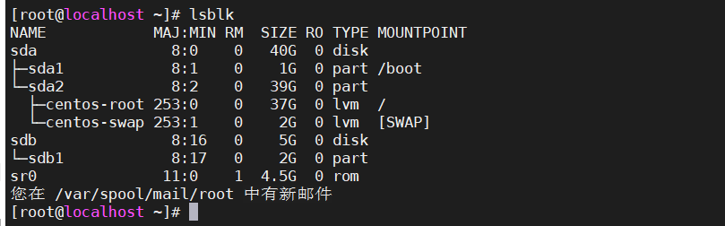
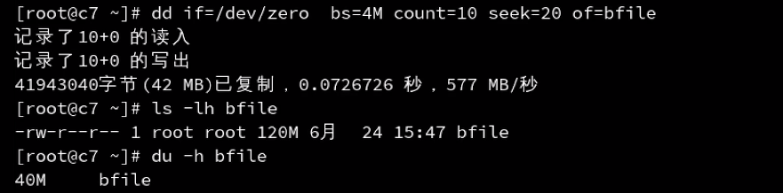

# 磁盘内容查看

## fdisk

fdisk -l

boot 系统启动

逻辑卷——centos-root

扇区查看

## parted 

这个命令，主要就是用来查看分区的

## df

df 关注点就是文件分区与挂载分区之间的关系

## lsblk

查看分区与挂载点

## 小结

| 命令  | 特点                 |
| ----- | -------------------- |
| fdisk | 最全，但是信息也最多 |
| df    | 分区的使用情况       |
| lsblk | 查看块的分区情况     |

# 文件大小查看

du  实际占用的空间

du 比ls 查看出来的结果更小

