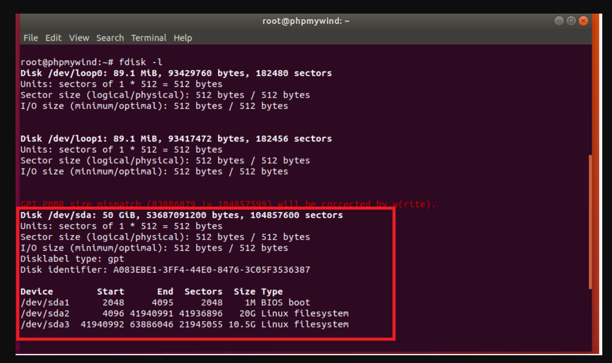
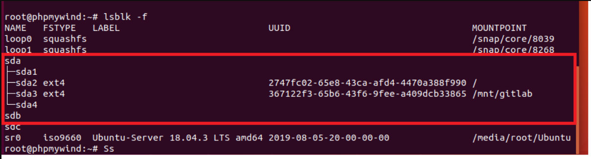
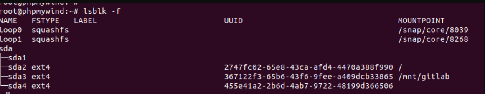
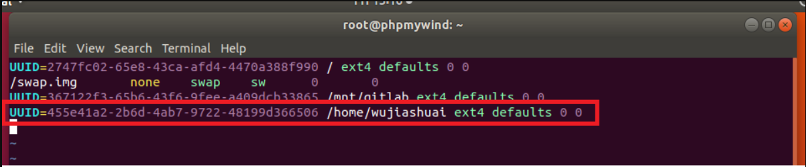
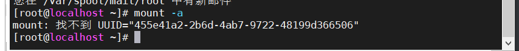
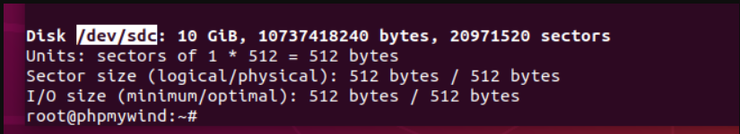

## 磁盘扩展
查看磁盘`fdisk -l`，可以下图中



可以看出，在`/dev/sda`这块磁盘中，存在三块分区，`sda1`,`sda2`,`sda3`.而`sda`这块磁盘中还存在一部分磁盘空间没有进行分区，那么现在就开始对`sda`剩下的磁盘空间进行分区

### 划分磁盘分区
使用命令`fdisk /dev/sda`
```
root@phpmywind:~# fdisk /dev/sda # 进入该磁盘，准备分区

Welcome to fdisk (util-linux 2.31.1).
Changes will remain in memory only, until you decide to write them.
Be careful before using the write command.

GPT PMBR size mismatch (83886079 != 104857599) will be corrected by w(rite).
GPT PMBR size mismatch (83886079 != 104857599) will be corrected by w(rite).

Command (m for help): n # 选择n选项，代表进行风区
Partition number (4-128, default 4): 4 # 分区号，和前面的sda1、sda2、sda3一样
First sector (63886047-104857566, default 63887360):  63887360 # sda3这块分区开始的块地址
Last sector, +sectors or +size{K,M,G,T,P} (63887360-104857566, default 104857566):#sda3块结束地址

Created a new partition 4 of type 'Linux filesystem' and of size 19.5 GiB.

Command (m for help): w # 代表将前面的操作都写入执行，然后退出。
GPT PMBR size mismatch (83886079 != 104857599) will be corrected by w(rite).

The partition table has been altered.
Syncing disks.

root@phpmywind:~# 

```
查看分区出来的结果


发现`sda4`已经分离出来了，但是没有部署文件系统。

### 设置文件系统
使用命令` mkfs.ext4 磁盘分区`，等待几秒即可，如果磁盘分区比较大，那么花费的时间也就会比较长。

```
root@phpmywind:~# mkfs.ext4 /dev/sda4
mke2fs 1.44.1 (24-Mar-2018)
Creating filesystem with 5121275 4k blocks and 1281120 inodes
Filesystem UUID: 455e41a2-2b6d-4ab7-9722-48199d366506
Superblock backups stored on blocks: 
	32768, 98304, 163840, 229376, 294912, 819200, 884736, 1605632, 2654208, 
	4096000

Allocating group tables: done                            
Writing inode tables: done                            
Creating journal (32768 blocks): 
done
Writing superblocks and filesystem accounting information: done   

root@phpmywind:~# 
```
分好后，查看，发现已经设置成功



### 挂载目录
将磁盘分区挂载到响应的目录下
#### 手动挂载
即每次开机不能自动挂载都要手动挂载
`mount -t ext4 -o rw /dev/sdb4 /home/wujiashuai`
就是这行命令，解释一下就是将` /dev/sdb4 `挂载到`/home/wujiashuai`下
#### 自动挂载
即每次开机后能够自动挂载，即修改`/etc/fstab`这个文件
首先获取对应的磁盘分区的`uuid`，注意这里是查看`/dev`目录下。

```
root@phpmywind:~# blkid /dev/sda4
/dev/sda4: UUID="455e41a2-2b6d-4ab7-9722-48199d366506" TYPE="ext4" PARTUUID="7f6f1703-7eb3-7348-adb0-56c5c2a5548b"
```
修改`/etc/fstab`文件，将一行语句写入


+ 第一个0的意思，不要进行dump备份

+ 第二个0的意思，不要进行磁盘检查

结束编辑后，使用`mount -a`进行刷新即可。

 

这里既是刷新，也是检查配置文件有没有写错。如果写错则会进行报错



一定要没有错了，才可以。不然关机后，会启动不了，最后只能修改启动界面，才能修改回来。

 

## 磁盘挂载
磁盘挂载与磁盘扩展基本上是一样的
下面对`/dev/sdc`进行磁盘挂载



磁盘分区
```
root@phpmywind:~# fdisk /dev/sdc

Welcome to fdisk (util-linux 2.31.1).
Changes will remain in memory only, until you decide to write them.
Be careful before using the write command.

Device does not contain a recognized partition table.
Created a new DOS disklabel with disk identifier 0xe8c8ae93.

Command (m for help): n
Partition type
   p   primary (0 primary, 0 extended, 4 free)
   e   extended (container for logical partitions)
Select (default p): 

Using default response p.
Partition number (1-4, default 1): 
First sector (2048-20971519, default 2048): 
Last sector, +sectors or +size{K,M,G,T,P} (2048-20971519, default 20971519): 

Created a new partition 1 of type 'Linux' and of size 10 GiB.
```
磁盘系统设置
```
root@phpmywind:~# mkfs.ext4 /dev/sdc1
mke2fs 1.44.1 (24-Mar-2018)
Creating filesystem with 2621184 4k blocks and 655360 inodes
Filesystem UUID: fd5f67fa-021f-42c2-ba0f-cfddbeeebff5
Superblock backups stored on blocks: 
	32768, 98304, 163840, 229376, 294912, 819200, 884736, 1605632

Allocating group tables: done                            
Writing inode tables: done                            
Creating journal (16384 blocks): done
Writing superblocks and filesystem accounting information: done 

root@phpmywind:~# 

```
挂载磁盘,并且检查磁盘挂载情况
```
root@phpmywind:~# mount -t ext4 -o rw /dev/sdc1 /home/mounttest
root@phpmywind:~# lsblk -f
NAME   FSTYPE   LABEL                           UUID                                 MOUNTPOINT
loop0  squashfs                                                                      /snap/core/8039
loop1  squashfs                                                                      /snap/core/8268
sda                                                                                  
├─sda1                                                                               
├─sda2 ext4                                     2747fc02-65e8-43ca-afd4-4470a388f990 /
├─sda3 ext4                                     367122f3-65b6-43f6-9fee-a409dcb33865 /mnt/gitlab
└─sda4 ext4                                     455e41a2-2b6d-4ab7-9722-48199d366506 
sdb                                                                                  
sdc                                                                                  
└─sdc1 ext4                                     fd5f67fa-021f-42c2-ba0f-cfddbeeebff5 /home/mounttest
sr0    iso9660  Ubuntu-Server 18.04.3 LTS amd64 2019-08-05-20-00-00-00               /media/root/Ubuntu
root@phpmywind:~# 

```

