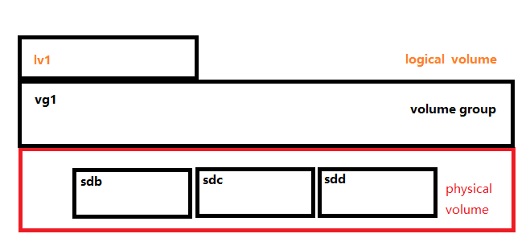

## 逻辑卷LVM管理

一个物理设备就是一个物理卷、也就是一块硬盘也就是一个物理卷。

逻辑卷使用起来比物理卷更加灵活。由于系统是放在逻辑卷上的，因此可以通过扩展逻辑卷，从而可以实现不关机扩展卷。

逻辑卷是将几个物理卷圈到一起，将多个大小不通的物理卷（硬盘）拼接到一起，拼接成逻辑组。然后按照需要进行切割成逻辑卷

## 创建流程




## 创建物理卷(physical volume)

pv操作

```shell
[root@localhost ~]# pvcreate /dev/sdb /dev/sdc /dev/sdd
  Physical volume "/dev/sdb" successfully created.
  Physical volume "/dev/sdc" successfully created.
  Physical volume "/dev/sdd" successfully created.
```

查看物理卷

```shell
[root@localhost ~]# pvs
  PV         VG     Fmt  Attr PSize   PFree
  /dev/sda2  centos lvm2 a--  <39.00g 4.00m
  /dev/sdb          lvm2 ---    5.00g 5.00g
  /dev/sdc          lvm2 ---    5.00g 5.00g
  /dev/sdd          lvm2 ---    5.00g 5.00g
```

可以看到有一个逻辑组centos，新的三个物理卷没有所属的逻辑组。

## 创建卷组(volume group)

为新增加的三个物理卷创建所属的卷组

```bash
[root@localhost ~]# vgcreate vg1 /dev/sdb /dev/sdc /dev/sdd
  Volume group "vg1" successfully created
```

查看卷组

```shell
[root@localhost ~]# vgs
  VG     #PV #LV #SN Attr   VSize   VFree
  centos   1   2   0 wz--n- <39.00g   4.00m
  vg1      3   0   0 wz--n- <14.99g <14.99g
```

其中pv，是这个逻辑组有几个物理卷。lv则是这个逻辑组有几个逻辑卷。

一个pv不能加入到两个卷组。


## 创建逻辑卷(logical  volume)

创建好逻辑组之后，就需要对逻辑组进行切割，切割出逻辑卷进行使用。

```bash
[root@localhost ~]# lvcreate -L 100M -n lv1 vg1
  Logical volume "lv1" created.
```

`-L`指的是逻辑卷大小

`-n` 逻辑卷的名称

```
lvcreate -L 逻辑卷大小 -n 逻辑卷名称 卷组
```

查看效果

```bash
[root@localhost ~]# lvs
  LV   VG     Attr       LSize   Pool Origin Data%  Meta%  Move Log Cpy%Sync Convert
  root centos -wi-ao----  36.99g                                                
  swap centos -wi-ao----   2.00g                                                
  lv1  vg1    -wi-a----- 100.00m   
```


## 使用逻辑卷

将`lv1`看成一个分区即可。

```bash
[root@localhost ~]# mkfs.ext4 /dev/vg1/lv1
mke2fs 1.42.9 (28-Dec-2013)
文件系统标签=
OS type: Linux
块大小=1024 (log=0)
分块大小=1024 (log=0)
Stride=0 blocks, Stripe width=0 blocks
25688 inodes, 102400 blocks
5120 blocks (5.00%) reserved for the super user
第一个数据块=1
Maximum filesystem blocks=33685504
13 block groups
8192 blocks per group, 8192 fragments per group
1976 inodes per group
Superblock backups stored on blocks:
        8193, 24577, 40961, 57345, 73729

Allocating group tables: 完成
正在写入inode表: 完成
Creating journal (4096 blocks): 完成
Writing superblocks and filesystem accounting information: 完成

[root@localhost ~]# mkdir /mnt/test
[root@localhost ~]# mount -t ext4 -o rw  /dev/vg1/lv1 /mnt/test/

```


## 扩展系统盘

扩展系统盘，其实也就是扩展逻辑卷。因为是扩充逻辑卷

### 扩展卷组

因为卷组中没有空间了，所以需要先将物理卷扩展到逻辑组中。

```shell
[root@localhost ~]# vgextend centos /dev/sdd
  Volume group "centos" successfully extended
```


### 扩展逻辑卷

```shell
[root@localhost ~]# lvextend -L +2G /dev/centos/root
  Size of logical volume centos/root changed from 36.99 GiB (9470 extents) to 38.99 GiB (9982 extents).
  Logical volume centos/root successfully resized.
```

查看扩展情况

```shell
[root@localhost ~]# lvs
  LV   VG     Attr       LSize  Pool Origin Data%  Meta%  Move Log Cpy%Sync Convert
  root centos -wi-ao---- 38.99g  
```

已经增加了2G。

### 刷新系统文件系统

如果是ext4文件系统那么是不需要进行查看。如果是xfs文件系统，是需要进行刷新的。

```
xfs_grows /dev/centos/root
```

即`xfs_grows 逻辑卷名称`