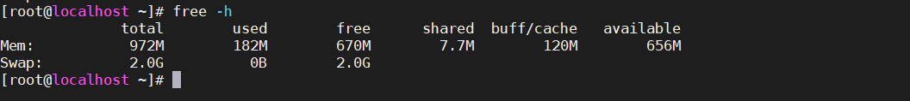

# 交换分区的查看与创建

交换分区就是虚拟内存，交换分区会在内存资源全部被占用后，启用充当内存的作用。



# 交换分区的创建

## 增加交换分区的大小

向挂载普通磁盘一样，进行操作

### 分区创建swap

```bash
[root@localhost ~]# fdisk /dev/sdb
欢迎使用 fdisk (util-linux 2.23.2)。

更改将停留在内存中，直到您决定将更改写入磁盘。
使用写入命令前请三思。


命令(输入 m 获取帮助)：n
Partition type:
   p   primary (0 primary, 0 extended, 4 free)
   e   extended
Select (default p):
Using default response p
分区号 (1-4，默认 1)：1\
分区号 (1-4，默认 1)：
起始 扇区 (2048-10485759，默认为 2048)：
将使用默认值 2048
Last 扇区, +扇区 or +size{K,M,G} (2048-10485759，默认为 10485759)：+1G
分区 1 已设置为 Linux 类型，大小设为 1 GiB

命令(输入 m 获取帮助)：w
The partition table has been altered!

Calling ioctl() to re-read partition table.
正在同步磁盘。
```


### 为分区安装swap“文件系统”

```bash
[root@localhost ~]# mkswap  /dev/sdb1
mkswap: /dev/sdb1: warning: wiping old ext4 signature.
正在设置交换空间版本 1，大小 = 1048572 KiB
无标签，UUID=e896cdd8-2aaa-418e-933d-995c2c184439
```

### 打开swap

```
[root@localhost ~]# free -m
              total        used        free      shared  buff/cache   available
Mem:            972         186         664           7         121         651
Swap:          3071           0        3071
```

